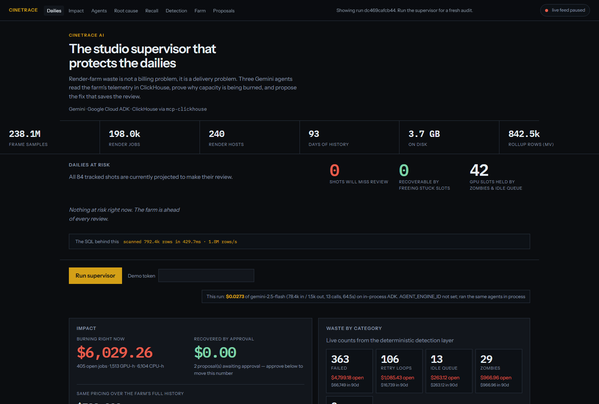
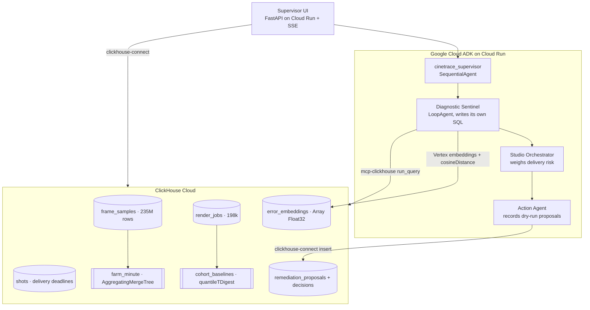

# CineTrace AI

**An autonomous VFX studio supervisor that protects the dailies.**

Render-farm waste is usually sold as a billing problem. It isn't. When a zombie
job pins eight GPUs overnight, the cost is not the $28 of compute — it is the
three shots that miss the 9am client review and the overtime that follows.

CineTrace AI watches 235 million rows of render-farm telemetry in ClickHouse,
proves *why* capacity is being burned, and proposes the fix that saves the
review. Three Gemini agents on Google Cloud ADK, querying ClickHouse through the
official `mcp-clickhouse` server.

- **Live supervisor:** https://cinetrace-781071502822.us-central1.run.app
- **Demo video:** https://vimeo.com/1220287055
- **Devpost:** https://devpost.com/software/cinetrace-ai

Built for [Agentic Cinema: The Blockbuster Hackathon](https://agentic-cinema.devpost.com/)
on the **ClickHouse** partner track.



## The farm

This is not a fixture. The demo runs against a synthetic but studio-scale farm:

| | |
| --- | --- |
| `frame_samples` | **235M rows** — one telemetry sample per job every 12s of wall time |
| `render_jobs` | **198k jobs** across 90 days, 6 shows, 240 render hosts |
| `farm_minute` | **802k rows** — incremental rollup kept current by a materialized view |
| `error_embeddings` | 494 past incidents with Vertex AI embeddings |
| On disk | 3.6 GB |

It is generated inside ClickHouse (`INSERT ... SELECT ... FROM numbers_mt`), so
a full rebuild takes about twenty minutes and is reproducible byte for byte.

## Architecture



## The three agents

Only these three exist. The pipeline around them is an ADK `SequentialAgent`,
which matters: the previous build used LLM-driven `sub_agents` transfer, and a
bad sample could silently skip remediation while still looking like a clean run.
Now detect → decide → act happens every time, and the reasoning inside each
stage is still the model's.

| Agent | Role |
| --- | --- |
| **Diagnostic Sentinel** | A `LoopAgent`. Gets the schema and the goal, not a list of queries, and composes its own SQL through MCP until it can name job ids with evidence. |
| **Studio Orchestrator** | Weighs the findings against the dailies schedule and picks 1–3 jobs whose slots most protect an upcoming review. |
| **Action Agent** | Records dry-run remediations with the evidence and the shot they protect. Never touches a render host. |

A typical run makes **14–16 MCP `run_query` calls**, all composed at runtime.
None of that SQL is hardcoded in this repo — the page shows you exactly what the
model wrote.

## Why this needs ClickHouse

The honest test for a partner track is whether the project would survive being
ported to Postgres. This one would not:

- **`ASOF LEFT JOIN`** pairs each OOM failure with the nearest telemetry sample
  recorded *before* it died: *"job-live-90003 died 20 seconds after rnd-f16 hit
  97% VRAM."* Scans 2.2M rows in ~114ms. No other engine expresses "the row just
  before this moment" in a single join.
- **Materialized view into `AggregatingMergeTree`** keeps a per-minute rollup
  current on insert, so the dashboard reads 802k pre-aggregated rows instead of
  235M raw ones.
- **`quantileTDigest` cohort baselines** replaced the old `cpu_hours >= 100`
  rule. An arnold CPU job legitimately burns 10x the hours of a redshift GPU job
  for the same shot, so "overrun" is defined as crossing a robust upper fence,
  `p50 + 3 × (p95 − p50)`, computed per (show, renderer).
- **`lagInFrame`** finds hosts failing repeatedly inside 90 minutes — a node
  problem, not six unlucky jobs.
- **Vector search** with `cosineDistance` over Vertex AI embeddings: describe a
  failure in plain language and the archive returns the incident that matches by
  *meaning*, with the fix that closed it.
- **Projections, skip indexes, TTL** on the fact table, because 235M rows with a
  live writer needs a retention story.

Every panel on the page reports what its query cost: rows scanned, milliseconds,
rows per second.

## The waste model

Two numbers, because they answer different questions.

**Open** is what an agent can still change: zombies holding GPUs, idle-queue
entries holding reserved slots, and failures from the last 48 hours that will be
resubmitted into the same wall. **Historical** prices the same rules across all
90 days — nobody can recover it, it exists to size the problem.

A completed overrun is never "open". The hours are spent and no action reclaims
them, so counting them as actionable would be dishonest arithmetic.

| Rate | Value | Why |
| --- | --- | --- |
| GPU-hour | **$3.50** | Studio GPU slot; GCP A100-class on-demand order of magnitude |
| CPU-hour | **$0.12** | Arnold / CPU render path; n2-standard vCPU order of magnitude |
| Idle queue | GPU-hour × wait/3600 | A reserved slot sitting unused |
| Overrun | hours above the cohort's tDigest fence | Slow relative to its own show and renderer |

Each job gets one primary waste class, so the headline is never double-counted.
These rates are a judge narrative, not a vendor quote.

**Recovery is credited on human approval, not on the agent's proposal.** An agent
finding waste does not reduce the bill; a supervisor approving the fix does. That
is why the Impact card only moves when you click Approve.

## Running it

Prerequisites: Python 3.10+, [uv](https://github.com/astral-sh/uv), and `gcloud`
application-default credentials on project `cinetrace-ai`.

```bash
cp .env.example .env          # fill CLICKHOUSE_HOST and CLICKHOUSE_PASSWORD
uv sync --extra dev

uv run python -m cinetrace.clickhouse.apply       # schema, in filename order
uv run python -m cinetrace.clickhouse.generate    # ~20 min, builds 235M rows
uv run python -m cinetrace.clickhouse.embeddings  # embeds the incident archive
uv run python -m cinetrace.clickhouse.health

uv run uvicorn cinetrace.web.app:app --reload --port 8080
```

Open `http://127.0.0.1:8080`. `uv run adk web src/cinetrace` stays available for
local agent debugging.

Useful flags on the generator: `--days`, `--jobs-per-day`, `--sample-seconds` to
build a smaller farm, and `--refresh-live` to rebuild only the last 48 hours.

```bash
uv run pytest                 # 64 tests; live-cluster ones skip without creds
```

## How to test (judges)

1. Open the [Cloud Run URL](https://cinetrace-781071502822.us-central1.run.app).
   The live pill top-right should be counting samples — the farm is running.
2. Read **Dailies at risk**. A few shots will miss their review; some are
   recoverable by releasing the slots stuck jobs are holding.
3. The agent timeline is pre-populated with the most recent run, so you can see
   the evidence without spending one. Expand **SQL the Sentinel wrote itself**.
4. Click **Run supervisor** for a fresh audit (no token during judging, 5 per
   hour, ~90 seconds). Watch it compose new queries.
5. Scroll to **Remediation proposals** and click **Approve**. The Impact card
   moves. That approval is the only thing that credits a saving.

Shot list: [docs/demo/shot-list.md](docs/demo/shot-list.md).
Ops calendar: [docs/judging-freeze.md](docs/judging-freeze.md).

## Deployment

Cloud Run redeploys from `main` via GitHub Actions using Workload Identity
Federation, so no GCP credentials live in this repo or with any agent. The
service runs `--min-instances=1 --no-cpu-throttling`: judging happens 23 Sep –
7 Oct, a cold start costs a judge nine seconds, and the live farm ticker is a
background task that dies if Cloud Run reclaims the CPU between requests.

One-time WIF bootstrap from a laptop already logged into `gcloud`:

```bash
bash scripts/gcp/setup-github-wif.sh
gh variable set GCP_WORKLOAD_IDENTITY_PROVIDER --repo asaf-avron/cinetrace-ai --body '<provider printed by the script>'
gh variable set GCP_SERVICE_ACCOUNT --repo asaf-avron/cinetrace-ai --body 'cinetrace-github-deploy@cinetrace-ai.iam.gserviceaccount.com'
uv run python scripts/sync_secrets.py    # ClickHouse creds -> Secret Manager
```

Agents also run on **Vertex AI Agent Engine**. Set `AGENT_ENGINE_ID` and the
supervisor calls the managed runtime; leave it empty and the identical
`root_agent` runs in process. The remote path fails soft — an IAM hiccup should
never be what a judge sees.

Set a [budget alert](https://console.cloud.google.com/billing) at 50% and 90% of
the $100 credits. The Agent Engine `:query` endpoint is IAM-only; do not grant
`allUsers`.

## Secrets

No secrets in git. Local `.env` is gitignored; hosted values live in Secret
Manager. Copy from `.env.example` and fill `CLICKHOUSE_HOST` and
`CLICKHOUSE_PASSWORD` from ClickHouse Cloud **Connect → HTTPS**, not the MCP tab.

## License

Apache License 2.0 — see [LICENSE](LICENSE). Copyright 2026 Asaf Avron.

## Submission

Deadline **9 Sep 2026, 2:00pm PDT**; judging **23 Sep – 7 Oct 2026**.
Criteria: technological implementation, design, potential impact, quality of
the idea.

- [x] Public repo with a detectable open-source license
- [x] Google Cloud and ClickHouse imported and called at runtime, not just named
- [x] Hosted project URL
- [x] 3-minute working demo video
- [x] Devpost form on the ClickHouse track
- [ ] Recut the video against the current UI before 3 Sep
