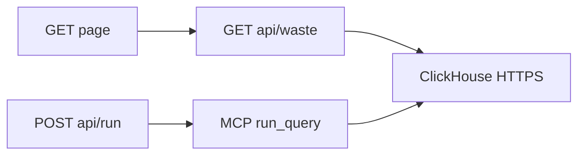

# Show the queries

Do this first. ClickHouse-track judges need to **see** SQL and real `job_id`s. Today the page only shows [`list_jobs`](src/cinetrace/clickhouse/proposals.py) and a Gemini text blob in `#summary`. The Sentinel already has the exact queries in [`src/cinetrace/clickhouse/queries.py`](src/cinetrace/clickhouse/queries.py) (`ALL_WASTE`: failed, retry_loops, idle_queue, zombies, overruns). Those never appear in the UI.

Public `GET /api/waste` is cheap (same path as `/api/jobs`). It does **not** need the demo token. A full supervisor run still uses MCP; the panel proves the same SQL against the same service.

## 1. Public waste API

- Add `GET /api/waste` in [`src/cinetrace/web/app.py`](src/cinetrace/web/app.py).
- For each entry in `ALL_WASTE`, run the SQL with **clickhouse-connect** (same client as jobs/proposals). Return `{ name, sql, rows }`.
- Do not invent rows. If ClickHouse is down, 503 like the other read APIs.
- Keep MCP as the agent path. This endpoint is the judge-visible twin, not a mock.

## 2. UI panel

- New section on [`src/cinetrace/web/templates/index.html`](src/cinetrace/web/templates/index.html) above or beside **Last run**: heading **ClickHouse via MCP** (or **Waste queries**).
- For each query: name, the SQL in a `<pre>`, and the returned `job_id`s (and a couple of columns).
- Load it from `refresh()` in [`src/cinetrace/web/static/app.js`](src/cinetrace/web/static/app.js) with jobs/proposals.

## 3. After a run

- `POST /api/run` already returns jobs + proposals. Also return (or re-fetch) waste results.
- Highlight `job_id`s that appear in new `remediation_proposals` for that run so the loop is visible: query → id → dry-run row.

**Out of scope:** Streaming MCP tool traces (plan 04). Dollar labels (plan 02). Extra agents. Changing Sentinel SQL unless a query is broken.
