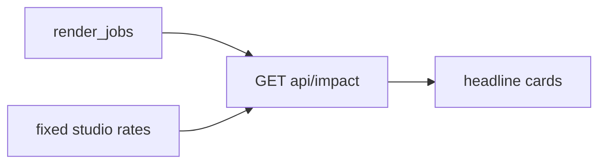

# Dollars on the waste

Do this with or right after plan 01. Judging includes **impact**. The seed already has the hook: `job-overrun` is 220 CPU-hours / 110 GPU-hours. The UI shows the hours and never prices them.

Use a **fixed studio rate** in code or env (not a live cloud bill). Example defaults: GPU-hour $2.50, CPU-hour $0.40 (document the assumption in the UI so it is not fake accounting). Env keys if you want them tunable: `CINETRACE_GPU_HOUR_USD`, `CINETRACE_CPU_HOUR_USD`. Empty env → those defaults. No secrets.

## 1. Impact query

- Add a named aggregation next to [`queries.py`](src/cinetrace/clickhouse/queries.py), run for real on ClickHouse. Something like: sum CPU/GPU hours on wasteful rows (failed + queued-idle + zombies + overruns), and a simple `$` expression.
- Wasteful set should match Sentinel categories so the number agrees with plan 01’s panel.
- Healthy completed jobs (`job-ok-*`) stay out of “at risk.”

## 2. Public API and job columns

- `GET /api/impact` → totals: `cpu_hours`, `gpu_hours`, `usd_at_risk`, rates used.
- Include per-job `usd` on `/api/jobs` (or compute in the client from rates + hours). Prefer server-side so the number is one source of truth.
- After `POST /api/run`, include `usd_saved_estimate` for the new dry-run proposals (sum of those jobs’ waste $). Still `executed=false` — label it **would save**, not **saved**.

## 3. Headline UI

- Three cards above the jobs table on [`index.html`](src/cinetrace/web/templates/index.html): **Hours wasted**, **$ at risk**, **$ this dry-run would save** (0 until a run in-session, then the estimate).
- Add a `$` column on the jobs table. Keep the existing hour columns.
- One muted line: “Studio rate assumption, not a cloud invoice.”

**Out of scope:** Real GCP billing APIs. Changing proposal persistence schema unless a `usd_estimate` column is clearly useful (a computed field is enough). Plan 03’s larger seed — this plan must work on the current eight rows (`job-overrun` should dominate).
