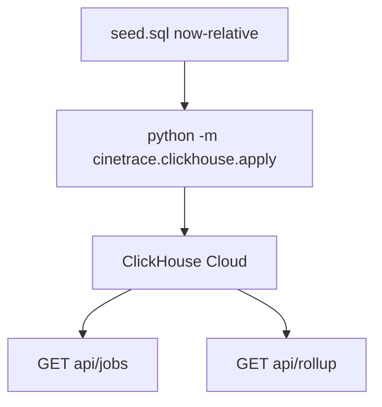

# Make the farm look alive

Do this after 01 and 02 so the query panel and $ headlines have more to show. Today [`seed.sql`](src/cinetrace/schema/seed.sql) is eight rows with hardcoded `2026-08-12` / `2026-08-13` timestamps. [`ZOMBIES`](src/cinetrace/clickhouse/queries.py) is `started_at < now('UTC') - INTERVAL 6 HOUR` — fixed dates go stale. There is no time series.

Still **synthetic**. No real farm, Kafka, or CSV drop. Do not invent extra agent roles.

## 1. Bigger, relative seed

- Keep the six waste archetypes and stable ids the demo talks about: `job-fail-oom`, `job-fail-lic`, `job-retry-loop`, `job-idle-queue`, `job-zombie`, `job-overrun`.
- Express their times with ClickHouse `now64(3)` math (zombie started `now() - INTERVAL 2 DAY`, idle queued `now() - INTERVAL 8 HOUR`, overrun finished this morning, etc.) so Sentinel categories stay true on judging day.
- Add on the order of **40–80** more jobs across NEBULA / AURORA / ORBIT (and maybe one more show): mix of completed, running, queued, a few extra failures. Enough that a `GROUP BY` looks like a farm.
- [`apply.py`](src/cinetrace/clickhouse/apply.py) already `TRUNCATE`s `render_jobs` then inserts. Do **not** truncate `remediation_proposals` unless you add an explicit optional step — old dry-runs can stay.
- Update [`tests/test_mcp_query.py`](tests/test_mcp_query.py) if it still asserts `count() == 8`.

## 2. Rollup the judges can see

- Named query: GPU/CPU hours by day (or show) for the last 14 days, plus queue depth (count of `queued`).
- Optional ClickHouse **materialized view** if it stays small and is actually queried — that is a track point. A straight `GROUP BY` is enough if an MV is awkward on Cloud.
- Public `GET /api/rollup` and a compact table or sparkline on the page. Prefer a simple table over a heavy chart library.

## 3. Re-apply and check

- Run `uv run python -m cinetrace.clickhouse.apply` then health + MCP smoke against the real service.
- Confirm plan 01 waste names still return the archetype ids, and plan 02 $ totals move in the right direction (overrun + zombie should still dominate).

**Out of scope:** Live ingest from a studio. Streaming inserts every minute (a refresh of `now()`-relative seed is enough). Redesigning agents. Touching Secret Manager.
