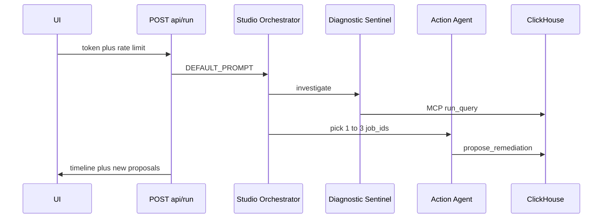

# Narrate the three agents

Do this after the query panel (01) and $ headlines (02). [`runner.py`](src/cinetrace/web/runner.py) already collects `[event.author]: text` from ADK. The UI dumps that into `#summary`. Authors are already the three roles: `diagnostic_sentinel`, `studio_orchestrator`, `action_agent`. No new agents.

## 1. Structured run payload

- In `run_supervisor`, keep the text summary, and also return `timeline: [{ agent, text }]` using `event.author`.
- Map authors to display names: Diagnostic Sentinel, Studio Orchestrator, Action Agent. Drop empty/tool-only events that have no text.
- Include `recorded` (already returned) and the `job_id`s those rows touched.
- Do not stream SSE in the first cut unless the wait (~1–2 min) feels broken; a single JSON response is enough. If you add progress later, keep it on `/api/run` and do not open a second Gemini call.

## 2. Timeline UI

- Section **Supervisor loop** on [`index.html`](src/cinetrace/web/templates/index.html): three columns or a vertical list — Detect / Decide / Dry-run — filled from `timeline`.
- Keep the raw summary collapsed or under **Last run** for debugging.
- After a successful run, mark new proposal rows (e.g. a class on the `<tr>`) so Action Agent → table is obvious.
- If plan 01 is done, reuse the same `job_id` highlight on the waste panel.

## 3. Copy only

- Toolbar status today: `Running detect → decide → dry-run…`. Keep that language; optionally expand to the three agent names while in flight.
- README one-liner: the hosted page shows the three-agent loop after Run.

**Out of scope:** A fourth agent, a planner, or a “narrator.” Changing Orchestrator policy. Agent Engine as the public demo. WebSockets.
