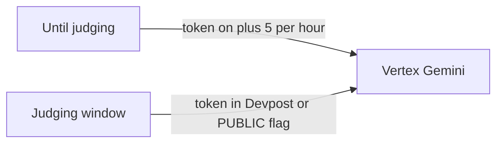

# Judging-week UX

Do this last, close to Devpost submit (**Sep 9, 2026 @ 2:00pm PDT**). Plans 01–04 make the page worth opening; this plan makes a stranger finish the loop.

Today: page and read APIs are public; **Run supervisor** needs `SUPERVISOR_RUN_TOKEN` ([`guard.py`](src/cinetrace/web/guard.py)). README says “ask the team.” Anonymous judges will not email you. Putting the token only in your head means they see tables and think the agents do not run.

## 1. How judges run it

Pick one and document it in the Devpost **How to test** field (not in git as a secret):

- **A (safer):** keep the token; paste it in Devpost how-to-test and the video. Speed bump for scrapers who only hit the URL.
- **B (smoother):** add `SUPERVISOR_RUN_PUBLIC=true` on Cloud Run for the judging window. Skip `token_ok` only when that flag is set. Keep `SUPERVISOR_RUN_ENABLED`, the **5/hour** limiter, ignored client `message`, and `--max-instances=1`. Hide the password field when public. Flip the flag back to false after.

Do not empty `SUPERVISOR_RUN_TOKEN` — fail-closed still treats empty as 401.

## 2. Three-minute video shot list

English or English subtitles. Working demo, not slides.

1. Open https://cinetrace-781071502822.us-central1.run.app — jobs load from ClickHouse.
2. Show the waste SQL panel (plan 01) and $ headlines (plan 02).
3. Run supervisor (token or public flag). Wait for the three-agent timeline (plan 04).
4. Point at a new `remediation_proposals` row: `executed=0`, `mode=dry_run`.
5. One line on stack: Gemini + ADK on Cloud Run, ClickHouse via MCP, three agents only.

Wake the ClickHouse Cloud service **before** recording so the first `SELECT` does not time out.

## 3. README / submit checklist

Extend [README.md](README.md) Hosted + Submission:

- [ ] Budget alert 50% / 90% of the $100 credits (console; you do this)
- [ ] Agent Engine `:query` still not `allUsers`
- [ ] ClickHouse awake; `/api/health` shows `clickhouse: true`
- [ ] How-to-test published (token or public flag)
- [ ] 3-minute video up
- [ ] Repo flipped **public** and OSS license added (only when you decide to submit)
- [ ] Devpost form, ClickHouse track

**Out of scope:** IAP, Cloud Armor, making the whole site private. Raising Vertex quotas. Linking Agent Engine as the judge URL.
